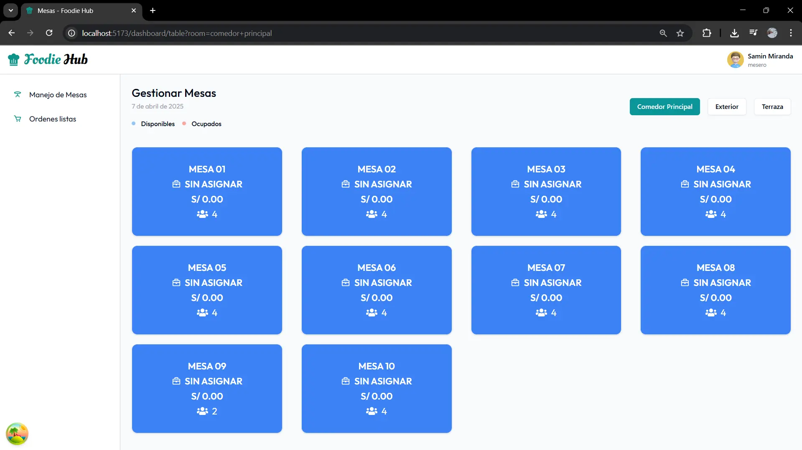
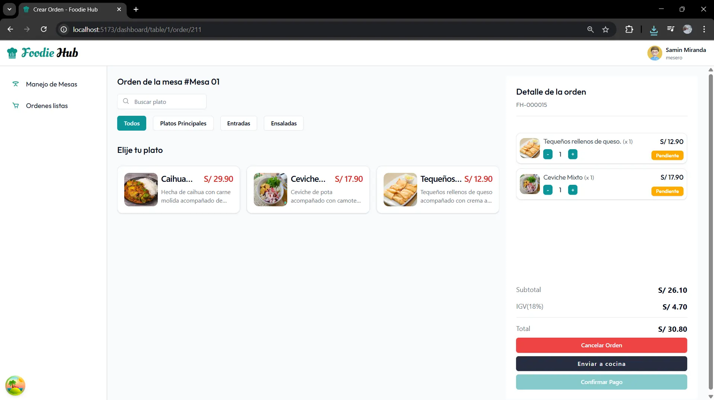
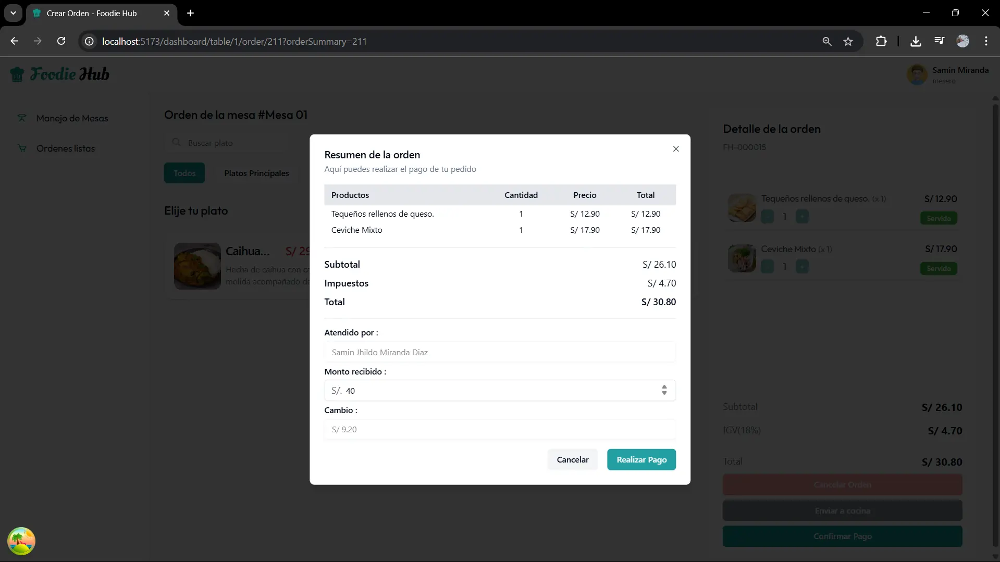

# Sistema de Restaurant - Frontend

Este es el cliente web del sistema de restaurantes. Permite a los meseros, cocineros y administradores gestionar órdenes en tiempo real de forma eficiente.

## 🚀 Tecnologías usadas

- [React](https://react.dev/)
- [React Hook Form](https://react-hook-form.com/)
- [TanStack Query (React Query)](https://tanstack.com/query/latest)
- [Shadcn UI](https://ui.shadcn.dev/)
- [Tailwind CSS](https://tailwindcss.com/)
- [React Router](https://reactrouter.com/)
- [Socket.IO Client](https://socket.io/)

# 🛠️ Funcionalidades principales
- Creación y gestión de ordenes.
- Roles de usuarios(mesero, cocinero, administrador).
- Notificaciones automaticas de cambios en pedidos.
- UI moderna con Shadcn UI y Tailwind.
- Comunicación con el backend mediante WebSocket y API REST.
- Manejo de estados con Tanstack query.

## 📦 Instalación

1. Clonar el repositorio:

   ```bash
   git clone https://github.com/RaulQD/frontend-system-restaurant.git

   ```
2. Instalar dependencia:

   ```bash
   npm install
   ```
3. Configuración variables de entorno .env:
   
   ```bash
   VITE_API_URL = TU_API_URL
   VITE_SOCKET_URL = TU_SOCKET_URL
   ```
4. Iniciar proyecto en desarrollo:

   ```bash
   npm run dev
   ```

## 📷 Capturas 

### Crear y pagar una orden



